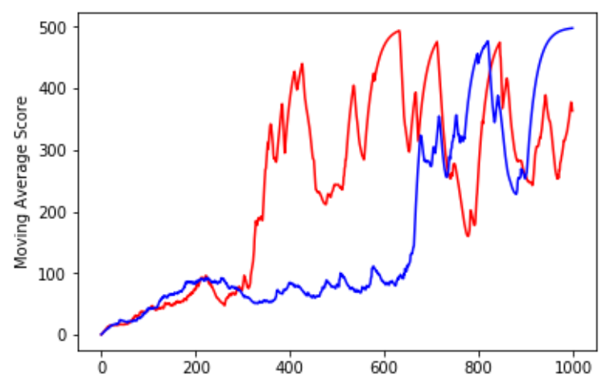

# Curiosity-Driven Exploration - pytorch implementation w/ CartPole (Simple version)
### Paper: [Curiosity-driven Exploration by Self-supervised Prediction, D. Pathak, 2017](https://arxiv.org/abs/1705.05363)

## Dependencies
- python 3.6.8 (Anaconda)
- pytorch 1.0.0
- gym 0.12.1

## Usage
- Easy easy. Install the dependencies and run the below command.

```
	python main.py
```

## Performance (sparse reward mode. only final penelty)
- Red: A2C with ICM, Blue: A2C w/o ICM
- A2C w/ ICM seems to converge slightly faster than the other on average in my experiments.




## Notes
- I trained the model in CartPole environment. However, it is not the best choice for experiment of curiosity
- I modified overall model architecture.
	- A2C instead of A3C (Just Actor Critic using Advantage, not parallel technique).
	- Very simple inverse model and forward model. Because the observation of CartPole is already some feature representations, not image.
	- Larger scaling factor of intrinsic rewards.

## Other Codes
- [Author's TensorFlow implementation with Doom](https://github.com/pathak22/noreward-rl)
